<div align="center">

  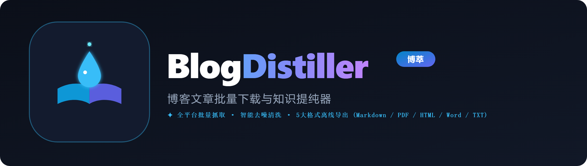

  # 🌟 BlogDistiller · 博萃
  ### 全网博文批量下载与知识蒸馏神器 · 打造博主专属「数字分身」
  **微信公众号 · 知乎 · 微博 · CSDN · 掘金 · 博客园 · 51CTO · 多平台全量去噪与多格式导出**

  <p>
    <!-- 访客总量统计徽章 (从 50+ 起步) -->
    <a href="https://github.com/yibeigen/wechat-article-exporter"></a>
    <!-- GitHub Stars -->
    <a href="https://github.com/yibeigen/wechat-article-exporter/stargazers"></a>
    <!-- 开源协议 (CC BY-NC-SA 4.0) -->
    <a href="LICENSE"></a>
    <!-- 作者 -->
    <a href="https://yibeigen.pages.dev/"></a>
  </p>

  <p>
    <a href="https://doc.305758.xyz"></a>
    <a href="https://github.com/yibeigen/wechat-article-exporter/releases"></a>
    
  </p>

  <p><b>「滤除网络杂质，沉淀纯粹知识。」</b><br>
  独家突破 2026 平台接口风控封锁，针对各大平台提供【桌面端 + 浏览器插件 + Web云端】立体化全能解决方案！</p>

  <br>

  | 🌐 官方介绍主页 | 🚀 在线导出工作台 | 💻 桌面端下载 (GitHub Releases) | 🔑 免费获取激活口令 |
  | :---: | :---: | :---: | :---: |
  | [**doc.305758.xyz**](https://doc.305758.xyz) | [**doc.305758.xyz/app**](https://doc.305758.xyz/app) | [**点击下载 Windows 客户端**](https://github.com/yibeigen/wechat-article-exporter/releases) | 关注公众号【**艺杯羹**】回复「**文章**」 |

</div>

<br>

---

## ⚡ 开发者手记：独立开发者两周极限闭关攻坚

> **“如果能把某位大佬在全网所有平台写过的文章、发过的思考全部提取出来，喂给 AI 知识库，是不是就能 1:1 复刻出这位博主的「数字分身」？”**

这便是我开发 **BlogDistiller（博萃）** 的初心。然而，这个项目能够在短短两周内硬核攻克并完整落地，背后的攻坚历程远比想象中艰难紧迫得多：

- ⏳ **2026 年 7 月风控大地震**：各大平台收紧反爬策略，微信官方彻底切断了旧版抓取通道，市面上 90% 的文章导出工具一夜之间全军覆没！
- 💻 **连续两周闭关硬核逆向**：为了彻底攻破抓取瓶颈，我一个人闭关奋战整整两周，夜以继日地抓包、调试通信协议，连续数个通宵高强度测试，最终独家打通了基于微信电脑版的通信链路，成功突破接口封锁！
- 🧩 **两周打通全栈多端生态**：在这高强度的两周里，不仅突破了底层通信协议，还同步自研了知乎/微博浏览器鉴权扩展、重构了高并发 FastAPI 爬虫清洗引擎、设计了 Web 在线工作台与 Windows 桌面端，并调优了出版级 PDF 矢量排版引擎……

**这个项目没有团队，从底层逆向、爬虫架构、FastAPI 后端、前端交互到多格式排版，全是我在两周内咬牙熬夜攻关出来的。**

---

## 🌟 如果这个项目帮到了你，请给个 Star 吧！

开源不易，独立维护更加艰难。**如果您觉得这个项目对您的学习、研究或知识库搭建有所帮助，请动动手指为本项目点亮右上角的 🌟 Star！**

您的每一个 Star 和每一次分享，都是我持续更新、硬抗平台风控、免费维护下去的最大动力！💖

<div align="center">
  <p><b>👇 扫码关注作者公众号【艺杯羹】，回复「文章」秒得专属永久激活口令 👇</b></p>
  
</div>

---

## ⚡ 3 大立体化作战方案（各平台最佳实践）

针对不同平台的反爬机制与技术架构，BlogDistiller 提供了最优雅的应对策略：

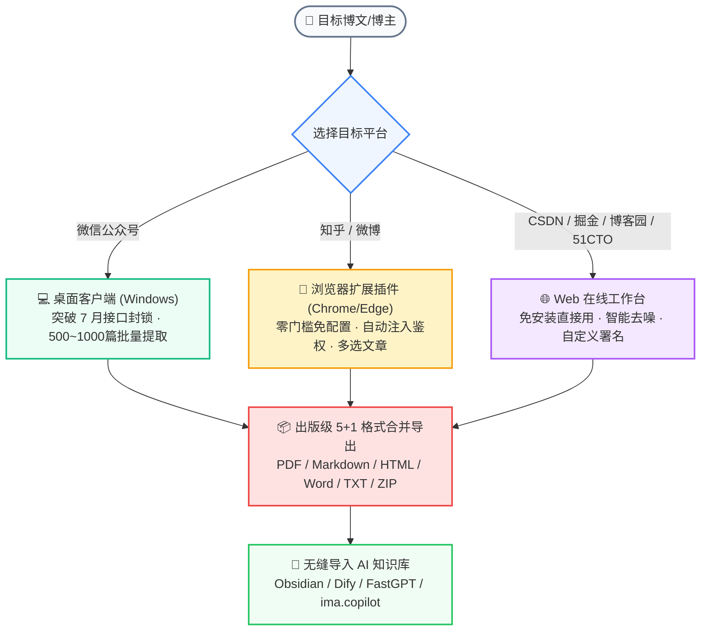

---

## 1️⃣ 微信公众号专线 · 桌面独立客户端

> **🔥 核心优势**：突破官方接口限制，单次可批量抓取 **500 ~ 1000+ 篇** 历史文章，支持断点续传与多格式导出！

### 📥 步骤 1.1：下载客户端
进入 [官网首页](https://doc.305758.xyz) 或 [GitHub Releases](https://github.com/yibeigen/wechat-article-exporter/releases) 页面下载：
- **`.exe` 安装包**：一键安装，桌面快捷方式启动；
- **`.zip` 绿色便携版**：解压即用，无需安装。

<div align="center">
  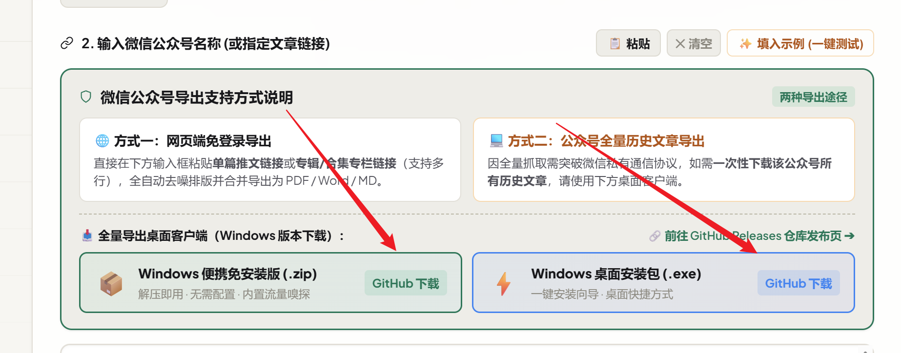
  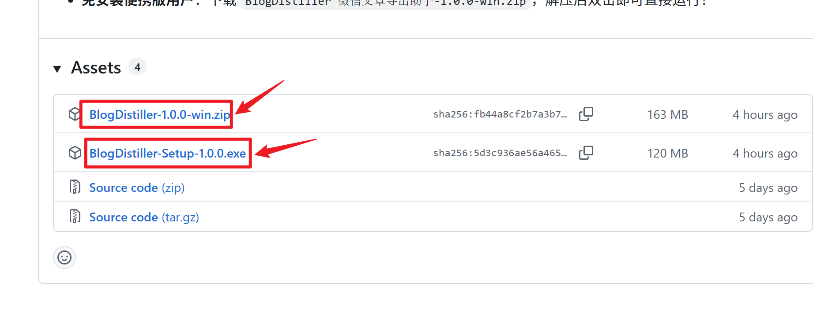
</div>

### 🔗 步骤 1.2：复制文章链接并粘贴
打开手机微信或电脑微信，找到目标公众号的任意一篇文章，**复制文章链接**，粘贴到桌面客户端中：

<div align="center">
  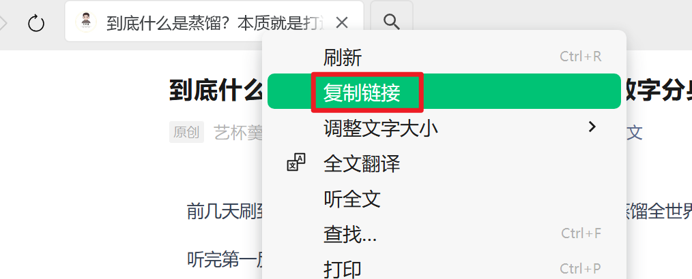
  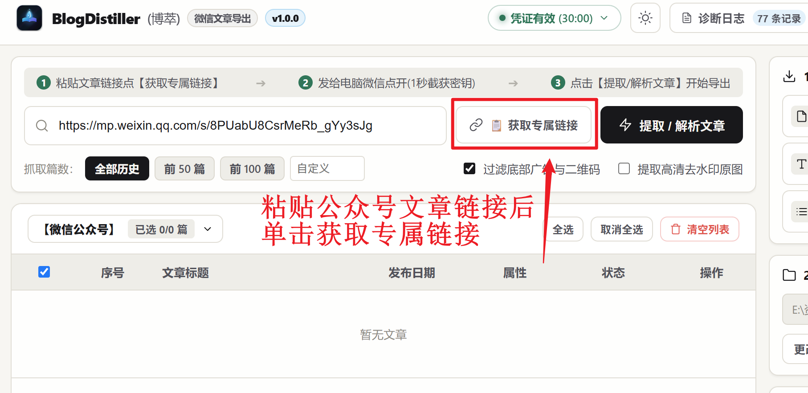
</div>

### 📱 步骤 1.3：电脑微信打开专属主页链接
客户端会自动解析并生成**当前公众号的主页专属链接**。复制此链接并发送给微信上的任意联系人（如文件传输助手），在**电脑微信内点击打开**：

<div align="center">
  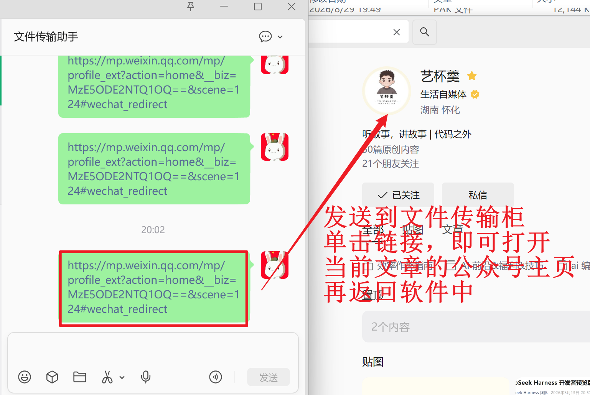
  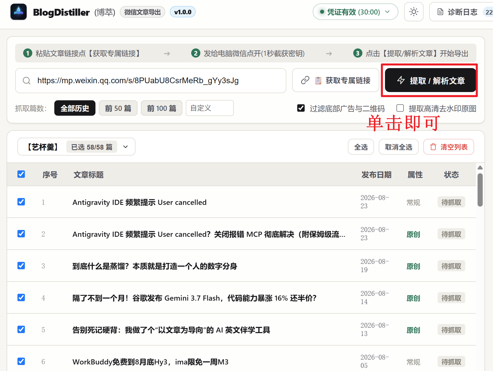
</div>

### 🚀 步骤 1.4：客户端全自动无感抓取与导出
电脑微信打开公众号主页后，客户端会自动识别并建立通信通道，点击【开始提取全部文章】即可全自动批量抓取！

<div align="center">
  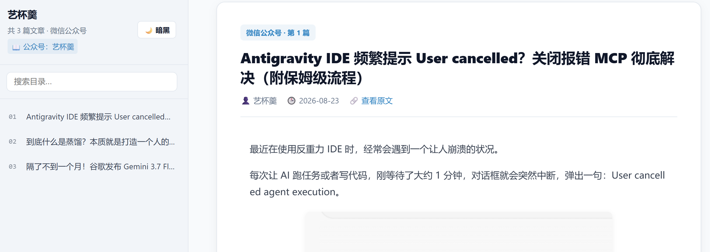
  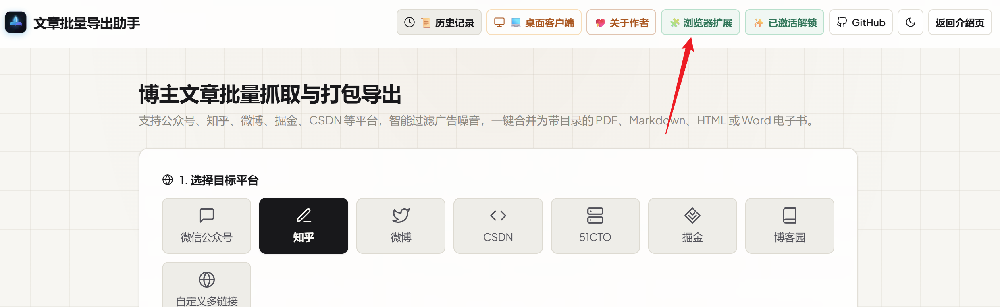
</div>

---

## 2️⃣ 知乎 / 微博专线 · 浏览器扩展插件

> **🔥 核心优势**：无需手动抓包复制 Cookie，插件一键自动提取与注入，支持自定义勾选批量下载！

### 🧩 步骤 2.1：加载浏览器扩展
1. 在 [官网](https://doc.305758.xyz) 或 Releases 下载扩展压缩包 `extension.zip` 并解压；
2. 打开 Chrome 或 Edge 浏览器，进入 `chrome://extensions/`；
3. 开启右上角【开发者模式】，点击【加载已解压的扩展程序】，选择解压出的 `extension` 文件夹。

<div align="center">
  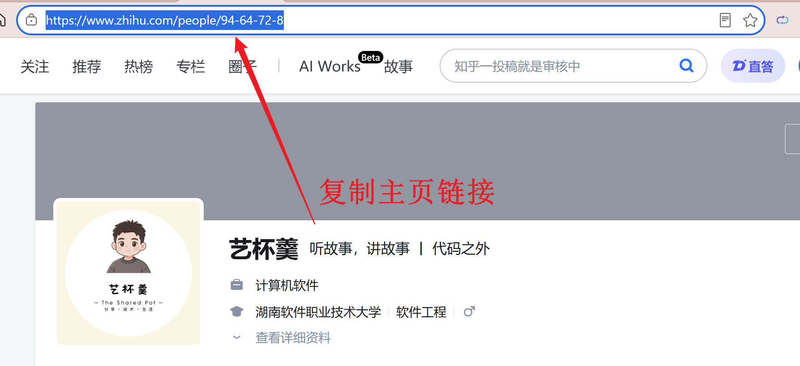
  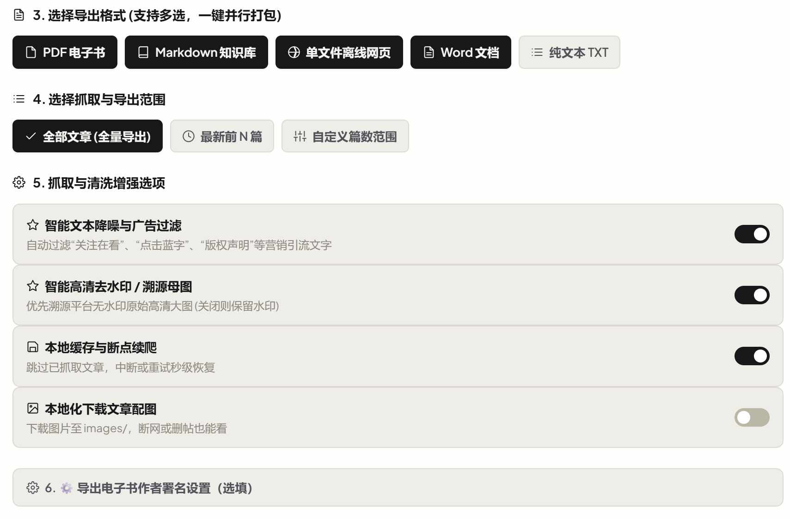
</div>

### 🎯 步骤 2.2：打开知乎/微博博主主页
登录知乎或微博网页版，进入任意博主的主页或文章列表页：

<div align="center">
  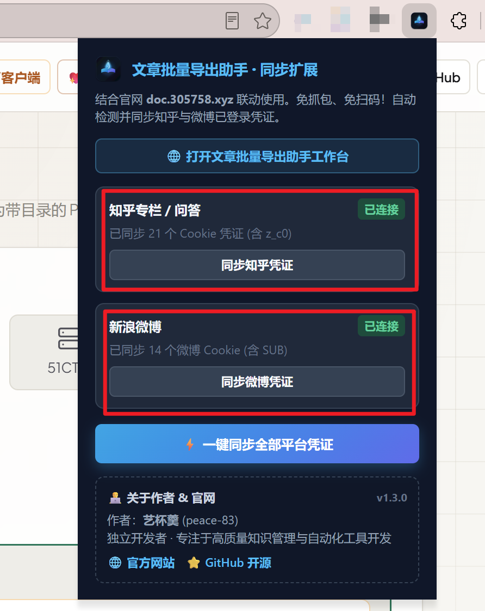
  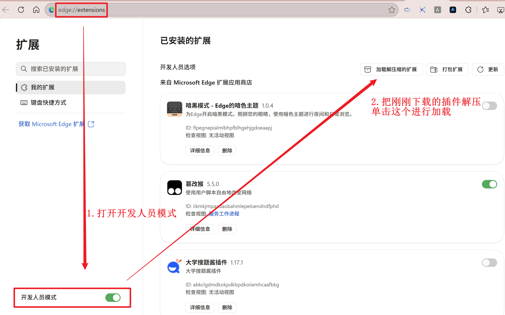
</div>

### ⚡ 步骤 2.3：一键提取并跳入导出工作台
点击浏览器右上角 BlogDistiller 插件图标，点击【提取当前主页博文】➔ 自动跳转至在线工作台开始批量导出！

<div align="center">
  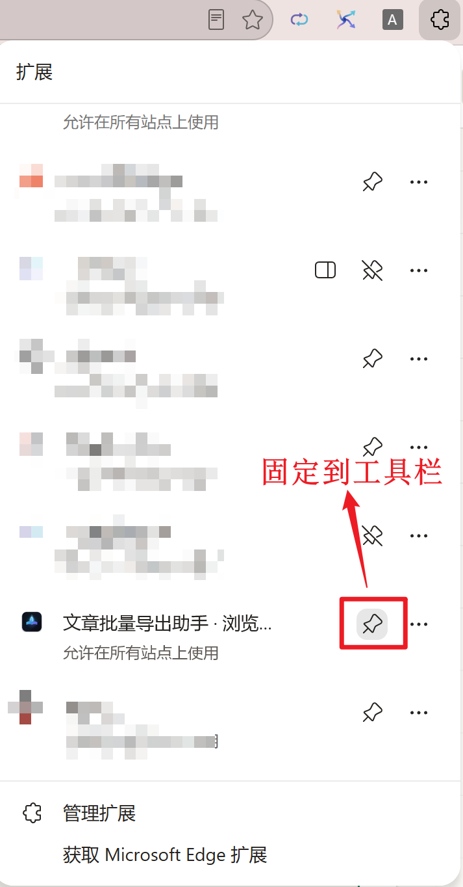
  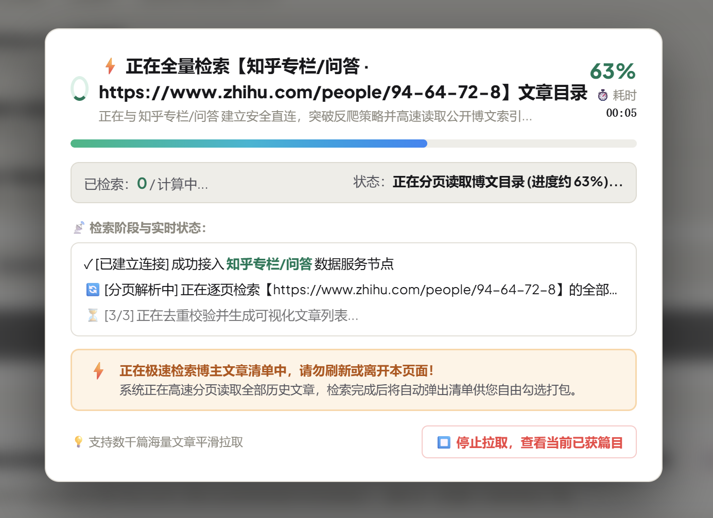
</div>

---

## 3️⃣ CSDN / 掘金 / 博客园 / 51CTO · Web 在线工作台

> **🔥 核心优势**：免安装任何软件，浏览器打开即用，秒级解析！

直接访问在线工作台：[**https://doc.305758.xyz/app**](https://doc.305758.xyz/app)

1. 选择目标平台（CSDN / 掘金 / 博客园 / 51CTO / 自定义多链接）；
2. 粘贴博主主页链接或多篇博文链接；
3. 点击【🚀 检索文章列表目录并挑选导出】，在弹窗中按需勾选；
4. 点击【立即下载】，实时显示进度并生成多格式下载包！

<div align="center">
  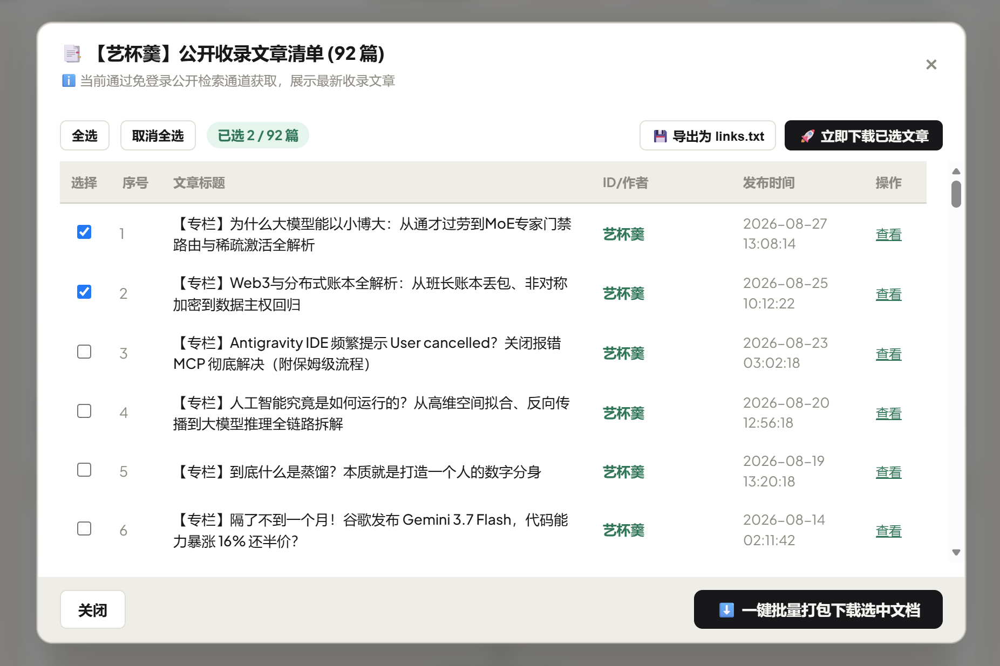
  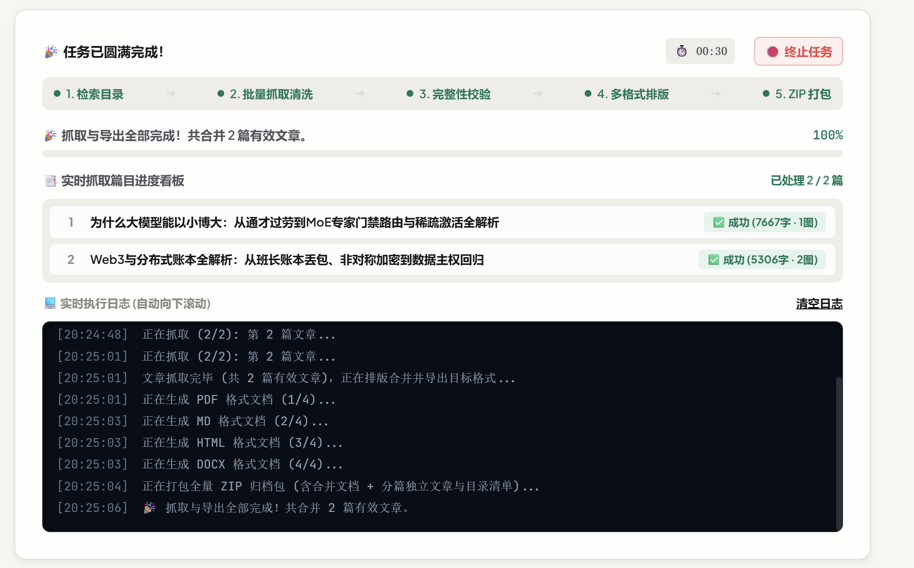
</div>

---

## 🛠️ 开发者本地自建指南 (Developer Quick Start)

如果您希望在自己的本地电脑或私有服务器上完全离线运行本项目：

```bash
# 1. 克隆本项目代码仓库
git clone https://github.com/yibeigen/wechat-article-exporter.git
cd wechat-article-exporter

# 2. 安装 Python 依赖环境 (推荐使用 uv 或 Python 3.10+)
uv venv .venv
uv pip install fastapi "uvicorn[standard]" httpx beautifulsoup4 markdownify lxml python-docx jinja2 pydantic playwright --python .\.venv\Scripts\python.exe

# 3. 安装 Playwright 渲染引擎 (用于知乎动态渲染)
.\.venv\Scripts\playwright.exe install chromium

# 4. Windows 下一键启动
start.bat
# 或通过命令行启动
python run.py
```
启动后在浏览器打开：`http://127.0.0.1:8000` 即可使用本地完整工作台！

---

## 📦 格式支持清单 (5 + 1 出版级导出)

| 格式 | 文件后缀 | 核心特性 | 最佳应用场景 |
| :--- | :---: | :--- | :--- |
| **知识库 Markdown** | `.md` | 标准 YAML 元数据头，自动提取标签与分类，图文相对路径 | 直接拖入 **Obsidian / Dify / FastGPT / RAG 知识库** |
| **出版级 PDF** | `.pdf` | 内置 Chromium 矢量渲染，封面设计、大纲目录书签、页眉页脚 | 适合 iPad / 电子书阅读器 / 离线永久珍藏 |
| **离线 HTML** | `.html` | 单文件零依赖运行，自适应侧边栏目录树，全文即时搜索，明暗主题 | 浏览器双击秒开，适合团队内网共享与文档知识站 |
| **Word 文档** | `.docx` | 原生 Heading 1/2/3 标题层级，高清真图居中内嵌，表格排版 | 便于二次编辑排版、打印交付或申报材料 |
| **纯文本语料** | `.txt` | 极致去噪清洗，剥离所有 HTML 标签与多余符号 | 适合 NLP 数据处理、大模型微调、RAG 向量切片 |
| **ZIP 归档全能包** | `.zip` | 包含上述 5 大合并单文件 + 所有独立分篇文档 + `00_全局目录索引.md` | 一揽子全量交付，一步到位 |

---

## 📜 开源协议、强制署名与防商用维权声明

本项目采用 **Creative Commons Attribution-NonCommercial-ShareAlike 4.0 International ([CC BY-NC-SA 4.0](LICENSE))** 协议开源，并附加以下强约束底线条款：

### 🚫 严禁任何商业盈利与倒卖 (Strictly Non-Commercial)
- 本项目**仅供个人非商业性学习研究与个人离线归档自用**；
- **严禁**任何个人或机构将本项目（包括源码、二进制 exe、前端界面、衍生版本）打包在淘宝、闲鱼、拼多多、知识付费等平台收费出售；
- **严禁**将本项目核心功能封装为收费 API 或付费 SaaS 商业服务；
- 商业授权或企业内网集成，必须事先取得原作者【**艺杯羹**】的书面许可。

### 🏷️ 强制保留原作者署名与仓库链接 (Attribution Required)
- 任何对此项目的引用、二开或衍生分发，**必须在软件显著位置（关于弹窗、网页 Footer、文档首页、导出制品元数据）完整保留「原作者：艺杯羹」及原 GitHub 仓库地址**；
- 严禁任何抹去、篡改作者版权信息的换皮行为。

### 🚨 侵权倒卖通报与维权曝光台 (Anti-Piracy Wall of Shame)
凡在网络平台发现非法倒卖本项目者，原作者将向 GitHub、电商平台及司法机关发起侵权索赔与强制下架，并在此处永久公示侵权店铺及账号信息！
- **侵权举报与商务联系**：微信 `peace-83` | QQ `3057454077` | 公众号【**艺杯羹**】

---

## 👨‍💻 关于作者与开发生态

**博主：艺杯羹**  
*独立开发者 · 效率工具与知识蒸馏系统创作者*

- **个人主页**：[yibeigen.pages.dev](https://yibeigen.pages.dev/)
- **CSDN 博客**：[博主 CSDN 主页](https://blog.csdn.net/qq_46987323?spm=1000.2115.3001.5343)
- **新浪微博**：[@艺杯羹](https://www.weibo.com/u/7583841270)
- **微信交流**：`peace-83` | **QQ 咨询**：`3057454077`

### 🚀 博主其他精品独立工具矩阵：
- 🎯 **[表达力训练平台 (305758.xyz)](https://305758.xyz/)**：结构化思维、即兴演讲与沟通口才智能训练系统
- 📖 **[英语文章精读网站 (cifan.305758.xyz)](http://cifan.305758.xyz)**：原汁原味英语时文精读与分级词汇深度解析
- 🎙️ **[智能跟随提词器 (pip.305758.xyz)](http://pip.305758.xyz)**：自适应语速智能滚屏、录课口播神器

<div align="center">
  <br>
  
  <p style="font-size: 0.88rem; color: #64748b; margin-top: 8px;">💖 如果这个项目对你的学习或工作有所帮助，欢迎赞赏支持作者持续迭代更新！</p>
</div>

---

<div align="center">
  <sub>微信公众号批量导出 · 公众号转PDF · 知乎专栏备份 · CSDN博客导出 · 微博长文归档 · RAG大模型知识库语料处理</sub>
</div>
