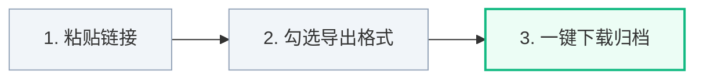

  

  # BlogDistiller · 博萃
  ### 全网博文批量下载与知识提纯器 · 浏览器在线一键导出

  

    
    
    
    
  

  
<b>滤除网络杂质，沉淀纯粹知识。</b> 无需配置任何本地环境，打开浏览器即可使用的博文批量抓取、去噪清洗与多格式合并导出系统。

   

  | 🌐 官方介绍主页 | 🚀 在线导出工作台 | 🔑 免费获取激活口令 |
  | :---: | :---: | :---: |
  | [**doc.305758.xyz**](https://doc.305758.xyz) | [**doc.305758.xyz/app**](https://doc.305758.xyz/app) | 关注公众号【**艺杯羹**】回复「**文章**」 |

 

---

## 🌟 核心亮点

- **全平台支持**：支持微信公众号、知乎专栏/回答、微博长文、CSDN、掘金、博客园、51CTO 及自定义多网页链接；
- **智能去噪去水印**：自动过滤“关注在看”、“点击上方蓝字”、“广告推荐”等营销引流套话，完整保留代码块、公式与高清配图；
- **5 大格式合并打包**：自动编排全局大纲目录（TOC），一键生成合并版单文件与全部分篇独立文件包；
- **开箱即用零门槛**：纯网页版云端驱动，无需在本地安装 Python、Node.js 或任何命令行工具。

---

## ⚡ 三步使用流程

1. **粘贴链接**：打开 [在线工作台](https://doc.305758.xyz/app)，选择平台并粘贴博主主页链接、公众号名称或文章网址；
2. **选择格式**：勾选需要的导出格式（PDF / Markdown / HTML / Word / TXT），设置抓取数量；
3. **一键下载**：点击启动抓取，实时查看提取进度，完成后一键保存单文件或 ZIP 归档大礼包。

---

## 📱 支持平台一览

| 平台 | 抓取方式 | 核心特性 |
| :--- | :--- | :--- |
| **微信公众号** | 公众号名称 / 文章 URL 列表 / 专辑合集 | 官方超链接通道全量遍历，免登录批量提取 |
| **知乎 (Zhihu)** | 专栏主页 / 用户主页 / 文章回答列表 | 自动去噪，公式 MathML/LaTeX 保留，高赞回答归档 |
| **微博 (Weibo)** | 博主主页 / 微博头条长文列表 | 微博头条长文提取，九宫格高清原图聚合 |
| **CSDN 博客** | 博主主页 / 专栏目录 | 过滤关注博主弹窗，保留高亮代码块与图表 |
| **稀土掘金** | 用户个人主页 | 深度遍历原创博文，纯净排版 |
| **博客园 (CNBlogs)** | 博客主页 | 深度解析博客园文章树，保留经典排版 |
| **51CTO 博客** | 博主专栏主页 | 分页遍历博主历史发表的技术架构文章 |
| **自定义多链接** | 粘贴多条任意网页 URL | 跨站通用正文提取，支持任意技术站点聚合打包 |

---

## 📦 5 种导出格式特性

| 格式 | 扩展名 | 核心特性与适用场景 |
| :--- | :---: | :--- |
| **Markdown** | `.md` | 带全局目录树与标准化 YAML 元数据，原生适配 Obsidian / Dify / FastGPT / Notion |
| **高清排版电子书** | `.pdf` | 内置精美书籍封面、大纲书签索引、页码与页眉页脚，媲美出版社纸质书 |
| **独立离线网页** | `.html` | 单文件离线运行，内置自适应侧边栏目录与全文实时搜索，支持明暗主题切换 |
| **Word 文档** | `.docx` | 原生 Word 大纲标题层级（Heading 1/2/3），表格与代码块完整保留，便于二次编辑 |
| **纯文本语料** | `.txt` | 纯净文本语料包，过滤所有复杂标签，适合 NLP 数据清洗与模型训练 |
| **ZIP 归档包** | `.zip` | 一键打包 5 种合并单文件 + 全部分篇独立文档 + `00_目录与索引清单.md` |

---

## 🔑 免费获取激活口令

为防止恶意爬虫刷量并维护服务器资源稳定，工具采用微信口令授权机制：

1. 微信扫一扫下方二维码关注公众号【**艺杯羹**】（或微信搜一搜 `艺杯羹`）；
2. 在公众号后台发送关键词：【**文章**】；
3. 即可秒得专属激活口令，在工作台输入**一次**即可永久解锁全格式批量导出！

  

---

## 👨‍💻 关于作者与矩阵生态

**博主：艺杯羹**  
*独立开发者 · 效率工具与知识系统创作者*

- **QQ 联系**：`3057454077`
- **微信交流**：`peace-83`
- **个人主页**：[yibeigen.pages.dev](https://yibeigen.pages.dev/)
- **CSDN 博客**：[博主 CSDN 主页](https://blog.csdn.net/qq_46987323?spm=1000.2115.3001.5343)
- **个人微博**：[博主微博主页](https://www.weibo.com/u/7583841270)

### 🚀 博主其他精品项目：
- 🎯 **表达力训练平台**：[305758.xyz](https://305758.xyz/) （结构化思维、即兴演讲与口才训练助手）
- 📖 **英语文章精读网站**：[cifan.305758.xyz](http://cifan.305758.xyz) （原汁原味英语时文精读与分级词汇解析）
- 🎙️ **语音跟随提词器**：[pip.305758.xyz](http://pip.305758.xyz) （自适应语速滚屏、录课口播智能提词神器）

   
  
  
💖 如果觉得工具好用，欢迎赞赏支持作者持续迭代！

---

## 📄 免责声明

1. 本工具仅供个人学习、离线研究与知识归档使用，严禁用于任何商业侵权或非法盗版传播行为；
2. 抓取的内容版权完全归原作者及原发布平台所有；
3. 请遵守各平台 Robots 协议与服务条款，合理控制抓取频率。

---

  微信公众号文章导出 · 公众号文章批量下载 · 公众号转PDF · 知乎专栏导出 · CSDN博客备份 · 微博长文导出 · RAG知识库语料处理

