<!-- BlogDistiller 官方中文开源项目 · 全网博文批量导出与知识归档助手 -->
<div align="center">

  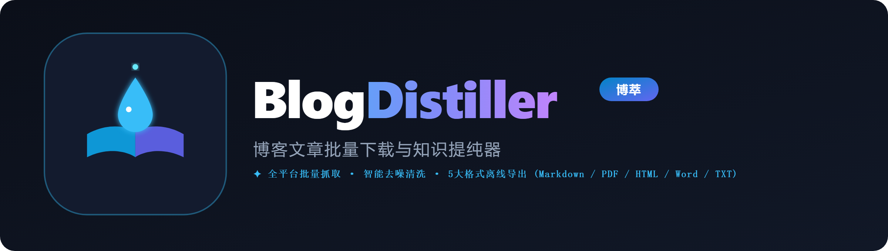

  # BlogDistiller · 博萃
  ### 全网博文批量下载与知识蒸馏神器 · 打造博主专属「数字分身」
  **微信公众号 · 知乎 · 微博 · 简书 · 新浪博客 · CSDN · 掘金 · 博客园 · 51CTO · 9 大主流平台全量去噪与多格式导出**

  <p>
    <!-- 动态实时访客总量统计徽章 -->
    <a href="https://github.com/yibeigen/wechat-article-exporter"></a>
    <!-- GitHub Stars -->
    <a href="https://github.com/yibeigen/wechat-article-exporter/stargazers"></a>
    <!-- 开源协议 (CC BY-NC-SA 4.0) -->
    <a href="LICENSE"></a>
    <!-- 作者 -->
    <a href="https://yibeigen.pages.dev/"></a>
  </p>

  <p>
    <a href="https://doc.305758.xyz"></a>
    <a href="https://github.com/yibeigen/wechat-article-exporter/releases"></a>
    
  </p>

  <p><b>「滤除网络杂质，沉淀纯粹知识。」</b><br>
  全面重构为<b>「本地优先（Local-First）」自治桌面客户端</b>。100% 本机计算与真实网络 IP，彻底解决云端 OOM 崩溃与平台风控阻断，轻松抗住数千篇超级博主极限归档。</p>

  <br>

  | 官方介绍主页 | 桌面客户端下载 (GitHub Releases) | 免费获取激活口令 |
  | :---: | :---: | :---: |
  | [**doc.305758.xyz**](https://doc.305758.xyz) | [**点击下载 Windows 客户端**](https://github.com/yibeigen/wechat-article-exporter/releases) | 关注公众号【**艺杯羹**】回复「**文章**」 |

</div>

<br>

> [!IMPORTANT]
> ### 项目架构重构与平台状态公告（2026-09）
> 
> 1. **全面转型「本地优先（Local-First）」桌面客户端**：
>    - **为什么重构？** 原纯网站版本在用户导出海量长文（如几千篇）时，高并发 I/O、图片下载与内存渲染全部由云端服务器承担，极易引发服务器内存 OOM 被系统强杀、机房 IP 遭遇 WAF 封控等瓶颈。
>    - **全新体验**：重构为桌面客户端后，**所有抓取、去噪、压缩与文档合成 100% 运行在用户本地电脑上**，使用用户本地宽带 IP，完全消除云端风控与卡死隐患，实测可丝滑处理 **6000+ 篇** 超大规模任务。
>    - **智能微内核热更新**：客户端内部嵌入了最新在线工作台，后续功能优化与平台规则适配将**自动静默热更新**，日常使用无需频繁重新前往 GitHub 下载安装包。
>
> 2. **各平台最新运行状态**：
>    - **微信公众号**：目前已全面支持【**公开专辑 / 合集链接**（URL 含 `appmsgalbum`）】与【**单篇 / 多篇公开文章链接（回车多行批量粘贴）**】。因微信 4.x 架构底层切换为私有 Native iLink 通道，旧版通过本地代理嗅探全号历史文章的方案暂时停用，新突破方案正在全力攻坚中。
>    - **知乎 / 微博**：在桌面客户端中已可直接批量解析，**不再需要额外安装浏览器扩展去抓包复制 Token**，使用门槛大幅降低。
>    - **简书 / 新浪博客 / CSDN / 掘金 / 博客园 / 51CTO**：全量稳定支持，无论是几十篇技术随笔还是数千篇历史专栏，均可一键极速检索并挑选导出。

---

## 项目支持 (Star)

开源不易，独立维护更加艰难。**如果您觉得这个项目对您的学习、研究或个人知识库搭建有所帮助，欢迎为本项目点亮右上角的 Star 支持一下。**

您的每一次 Star 和分享，都是项目持续免费维护迭代的动力。

<div align="center">
  <p>扫码加入交流群 / 关注公众号，获取激活口令与最新功能通知：</p>
  <table align="center" style="border: none; margin-top: 12px;">
    <tr>
      <td align="center" style="border: none; padding: 0 16px;">
        
        <br />
        <sub><b>博萃·文章导出交流群</b></sub>
        <br />
        <sub>扫码进群 · 交流使用技巧 · 反馈平台 Bug</sub>
      </td>
      <td align="center" style="border: none; padding: 0 16px;">
        
        <br />
        <sub><b>微信公众号【艺杯羹】</b></sub>
        <br />
        <sub>关注后回复「<b>文章</b>」免费领激活口令</sub>
      </td>
    </tr>
  </table>
  <p><sub>*说明：群二维码若过期失效，请关注公众号后回复「进群」添加作者微信拉你入群。*</sub></p>
</div>

---

## 系统架构：本地优先模式 (Local-First Architecture)

BlogDistiller 采用全新一代本地优先架构，将重算力与网络 I/O 彻底交还给本地执行：

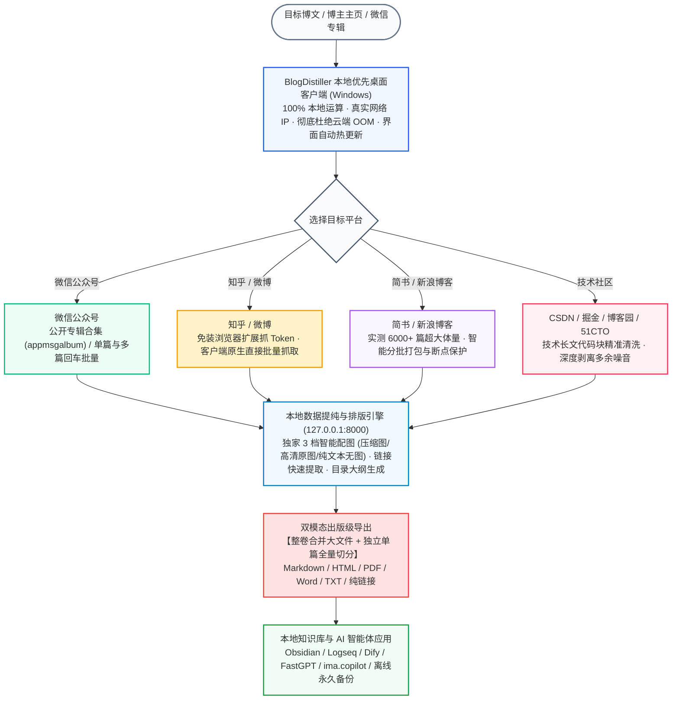
```mermaid
graph TD
    User([目标博文 / 博主主页 / 微信专辑]) --> Client["BlogDistiller 本地优先桌面客户端 (Windows)<br>100% 本地运算 · 真实网络 IP · 彻底杜绝云端 OOM · 界面自动热更新"]
    
    Client --> Choose{选择目标平台}
    
    Choose -->|微信公众号| P1["微信公众号<br>公开专辑合集 (appmsgalbum) / 单篇与多篇回车批量"]
    Choose -->|知乎 / 微博| P2["知乎 / 微博<br>免装浏览器扩展抓 Token · 客户端原生直接批量抓取"]
    Choose -->|简书 / 新浪博客| P3["简书 / 新浪博客<br>实测 6000+ 篇超大体量 · 智能分批打包与断点保护"]
    Choose -->|技术社区| P4["CSDN / 掘金 / 博客园 / 51CTO<br>技术长文代码块精准清洗 · 深度剥离多余噪音"]

    P1 --> Engine["本地数据提纯与排版引擎 (127.0.0.1:8000)<br>独家 3 档智能配图 (压缩图/高清原图/纯文本无图) · 链接快速提取 · 目录大纲生成"]
    P2 --> Engine
    P3 --> Engine
    P4 --> Engine

    Engine --> Export["双模态出版级导出<br>【整卷合并大文件 + 独立单篇全量切分】<br>Markdown / HTML / PDF / Word / TXT / 纯链接"]
    
    Export --> RAG["本地知识库与 AI 智能体应用<br>Obsidian / Logseq / Dify / FastGPT / ima.copilot / 离线永久备份"]

    style User fill:#f8fafc,stroke:#64748b,stroke-width:2px
    style Client fill:#eff6ff,stroke:#2563eb,stroke-width:2px
    style Choose fill:#f8fafc,stroke:#475569,stroke-width:2px
    style P1 fill:#ecfdf5,stroke:#10b981,stroke-width:2px
    style P2 fill:#fef3c7,stroke:#f59e0b,stroke-width:2px
    style P3 fill:#faf5ff,stroke:#a855f7,stroke-width:2px
    style P4 fill:#fff1f2,stroke:#f43f5e,stroke-width:2px
    style Engine fill:#f0f9ff,stroke:#0284c7,stroke-width:2px
    style Export fill:#fee2e2,stroke:#ef4444,stroke-width:2px
    style RAG fill:#f0fdf4,stroke:#16a34a,stroke-width:2px
```

---

## 核心功能与技术特性

### 1. 全面覆盖 9 大主流创作平台
不仅支持技术博客，更涵盖主流长文与社交观点阵地：
- **已支持**：微信公众号（单篇/合集）、知乎、微博、简书、新浪博客、CSDN、博客园、掘金、51CTO。
- **后续规划**：百家号、今日头条、搜狐博客等（根据社区反馈持续优先排期）。

<div align="center">
  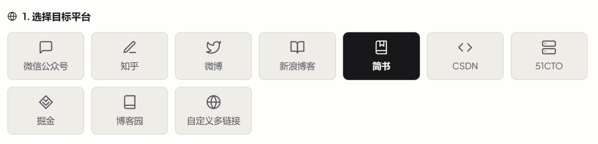
</div>

---

### 2. 独家 3 档智能配图引擎
> **实测痛点**：全量下载 1000 多篇博文时，原图素材常常暴增到 **14.5GB** 以上，既耗尽磁盘空间又拖慢后续 Markdown 知识库加载速度。

为此，BlogDistiller 设计了 **3 档灵活配图模式**：
- **压缩图（推荐）**：自动进行智能画质保真压缩，**体积大幅缩减 70% 以上**，兼顾视觉观感与轻量存储；
- **高清原图**：保留平台原始像素精度，适合设计、摄影、高精度图表留档；
- **不配图（纯文本）**：剥离全部外部图片引用，以极简轻量形式秒速出炉，是构建 RAG 向量切片与大模型语料的最佳拍档。

<div align="center">
  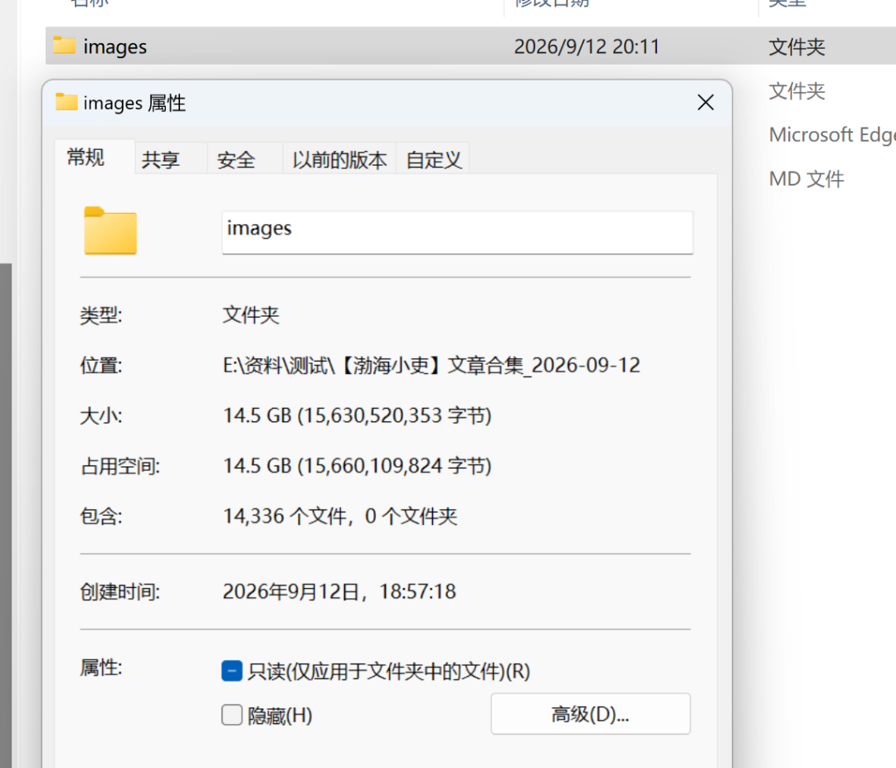
  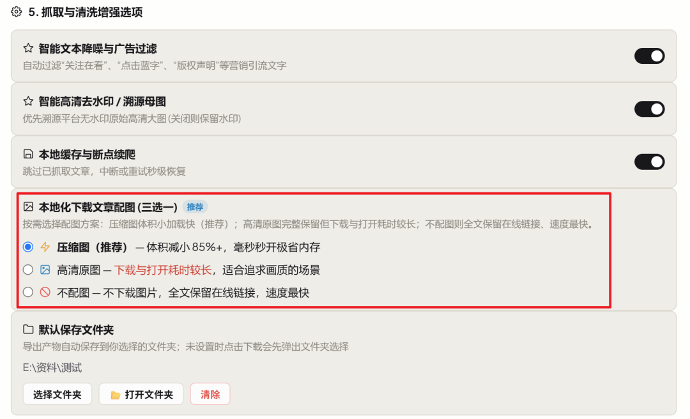
</div>

---

### 3. 一键导出纯博文 URL 链接列表
检索出目标博主的全部历史目录后，可以**直接一键下载纯文本链接清单**：
- 提取后的 URL 列表可以直接复制投喂给各类 **AI 智能体、Obsidian 插件、Dify / FastGPT 工作流或自主抓取脚本**，方便利用 AI 完成批量阅读总结、标签聚类或二次信息提炼。

<div align="center">
  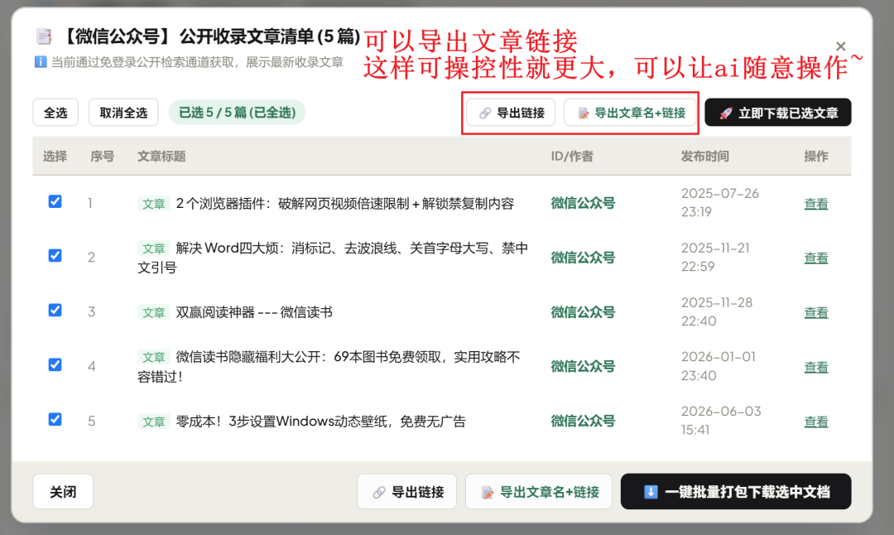
</div>

---

### 4. 双模态输出：整卷合并大文件 + 独立分篇自由调阅
生成的导出包具备清晰规整的归档体系：
- **整卷合并版**：生成自带大纲目录与全局索引的单文件（PDF / HTML / Markdown / Word），适合通读、打印和永久备份；
- **独立分篇归档**：同时自动切分并创建独立的篇章文档与多媒体目录，无论是检索单篇文章还是拖入 Obsidian 双链网络均可自如管理。

<div align="center">
  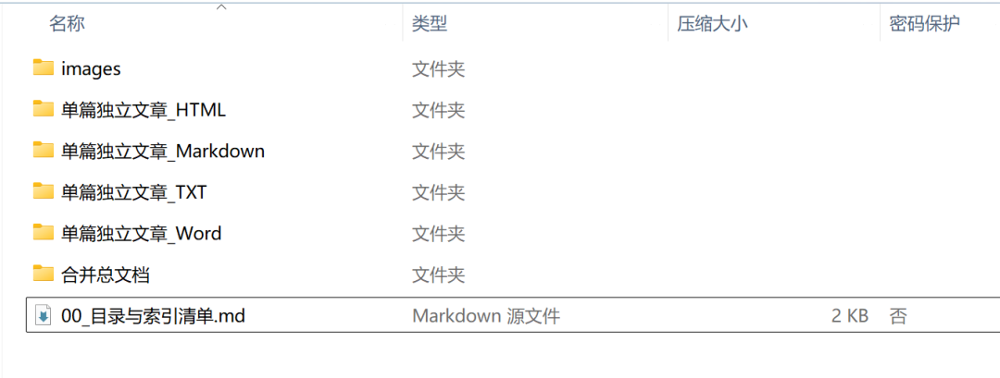
</div>

---

### 5. 压力测试实测：简书 6000+ 篇超大体量备份
针对海量文章博主，BlogDistiller 本地引擎集成了**流式异步 I/O、内存分页分批与断点保护机制**：
- **实测表现**：针对拥有 **6000+ 篇** 文章的简书博主进行全量实测，每 1000 篇仅需约 30 分钟即可完成高精度提取与排版；
- **自动分批导出**：面对数千篇超长合集，智能采用分批次打包方案，既杜绝浏览器打开数万行 HTML 时内存卡死崩溃，又确保每一批次都能快速落盘。

<div align="center">
  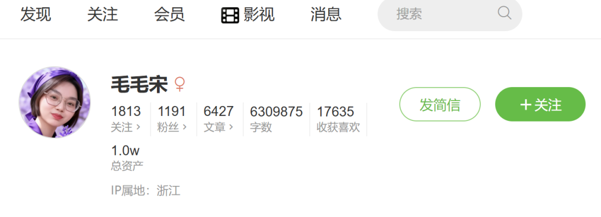
  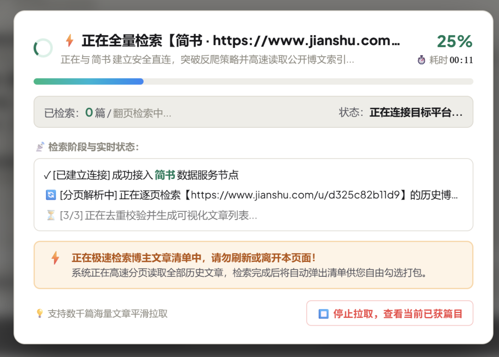
  <br>
  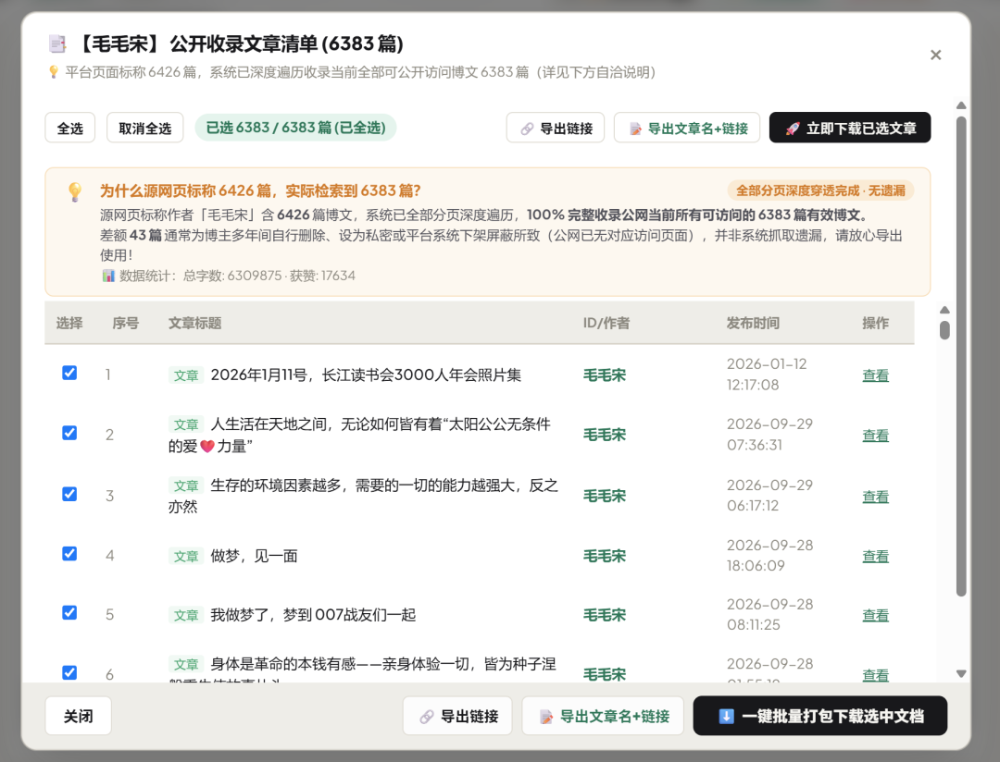
  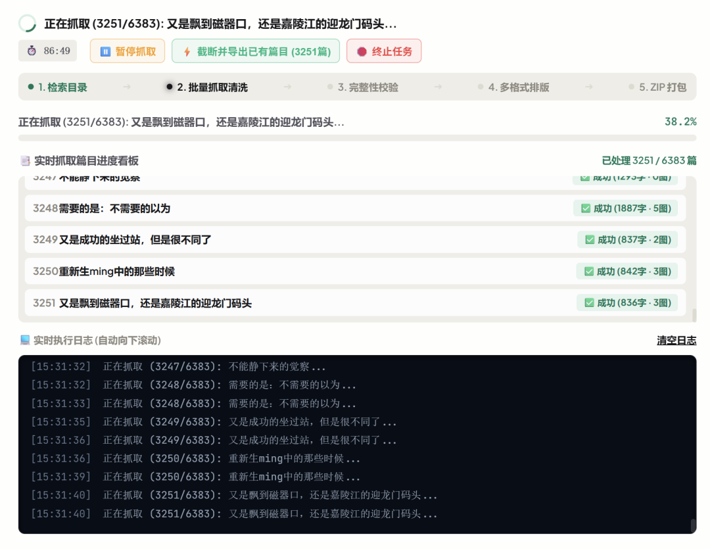
</div>

---

### 6. 离线 HTML 沉浸式阅读体验
导出的离线 HTML 忠实还原原网页排版布局，单文件脱机双击秒开：
- 内置**自适应响应式侧边栏目录树**，支持点击快速跳转与全文即时过滤搜索；
- 零外部 CDN 依赖，图片与样式全量离线固化，即便原网页被删帖也能永久完整阅览。

<div align="center">
  
  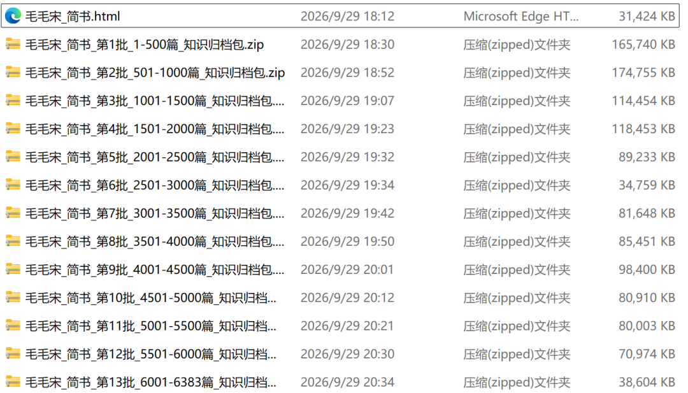
</div>

---

## 桌面客户端使用指南

### 步骤 1：下载并安装客户端
前往 [官网](https://doc.305758.xyz) 或 [GitHub Releases](https://github.com/yibeigen/wechat-article-exporter/releases) 页面，下载最新的 Windows 客户端安装包：
- **安装版**：双击一键安装，生成桌面图标；
- **便携绿色版**：解压即用，无任何注册表残留。

<div align="center">
  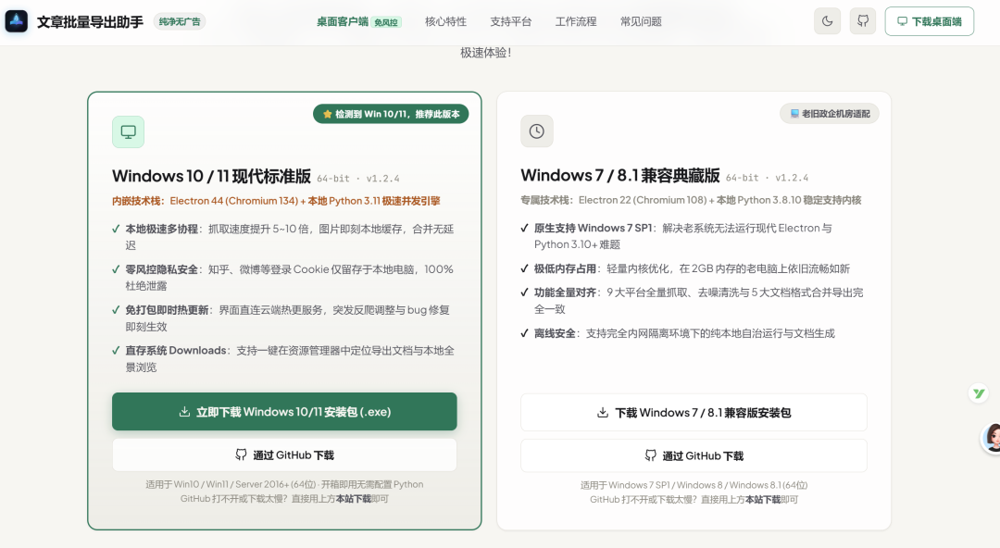
  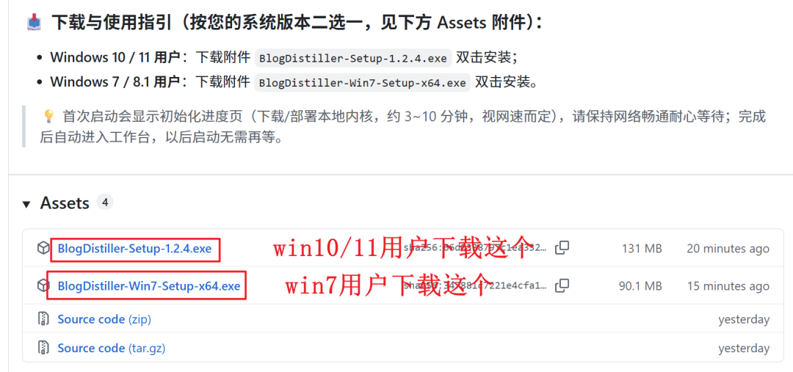
</div>

---

### 步骤 2：选择目标平台
打开桌面客户端，在平台列表中点击需要导出的目标平台（如简书、知乎、CSDN、微信公众号专辑等）：

<div align="center">
  
</div>

---

### 步骤 3：输入目标链接
- 若导出博主全部文章：粘贴**博主主页 URL**；
- 若导出微信公众号内容：粘贴**公众号公开专辑合集链接**，或**多篇单文链接（支持回车每行一篇批量粘贴）**；
- 点击【检索文章列表目录并挑选导出】。

<div align="center">
  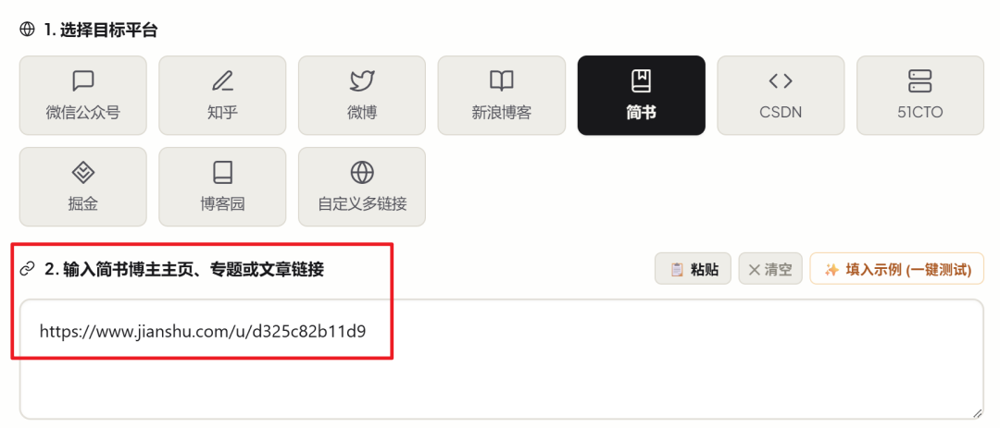
  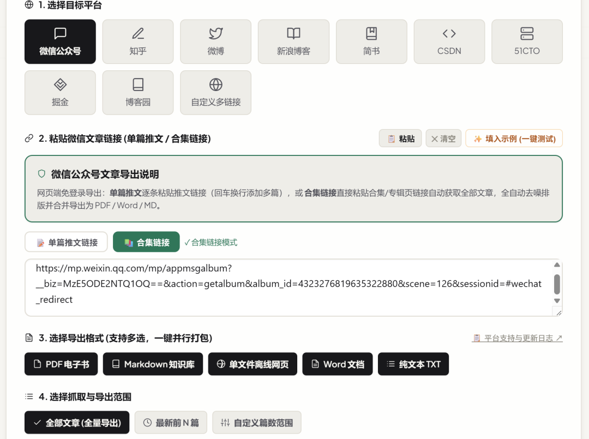
</div>

---

### 步骤 4：挑选文章、导出格式与配图模式
在弹出的检索结果列表弹窗中：
1. **勾选文章**：默认全选，可按需多选或取消部分文章；
2. **选择导出格式**：Markdown、HTML、PDF、Word、TXT（如篇幅极多推荐勾选 1~2 种最核心格式以提升生成效率）；
3. **选择配图模式**：推荐选择【压缩图】（兼顾画质并大幅节省空间）；
4. **选择保存目录**：自主指定保存到电脑上的任意文件夹。

<div align="center">
  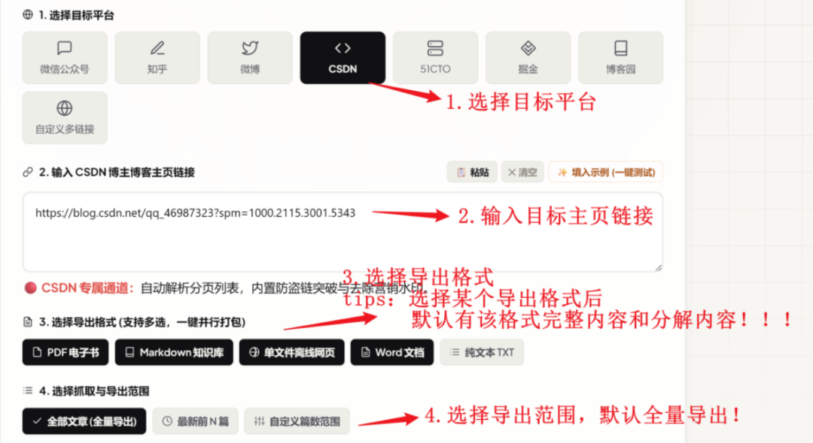
  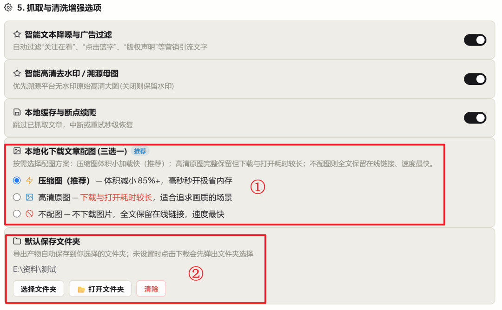
</div>

---

### 步骤 5：一键导出与离线查看
点击【立即下载】，系统将以多线程异步模式开始流水线抓取与渲染，并在界面上实时呈现动态进度条。导出完成后自动在您的保存目录中生成标准化交付包。

---

## 本地运行指南 (Local Quick Start)

如果您希望以纯源码方式在个人电脑上完全离线运行本项目（**100% 本地运算 · 零云端消耗 · 产物永久直存电脑**）：

### 方式一：Windows 一键启动（双击即用）

1. **下载源码**：
   - 点击本页面右上角绿色按钮 `Code` ➔ `Download ZIP` 下载源码压缩包并解压；
   - 或使用 Git 克隆：`git clone https://github.com/yibeigen/wechat-article-exporter.git`
2. **直接双击根目录下的 `start.bat`**：
   - 脚本会自动检测 Python 环境（若未安装会贴心提示下载安装）；
   - 首次启动会自动创建虚拟环境并静默安装全部依赖及渲染内核；
   - 启动后**会自动弹出默认浏览器直达工作台**：`http://127.0.0.1:8000`。
3. **启动成功界面展示**：
   - 双击后会弹出终端窗口，显示 `Uvicorn running on http://127.0.0.1:8000` 即代表**本地服务已完全就绪**（日常使用请保持此窗口开启，最小化即可）：

<div align="center">
  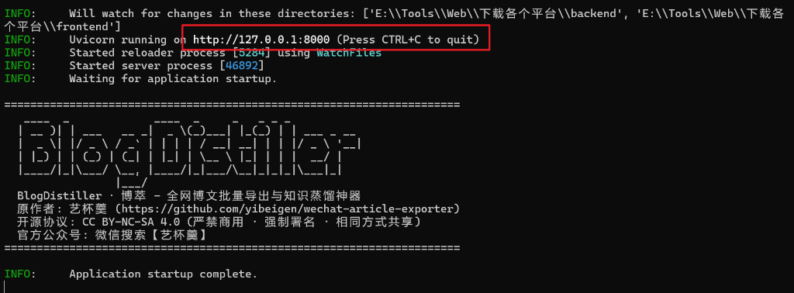
</div>

---

### 方式二：开发者命令行手动运行

```bash
# 1. 克隆代码并进入目录
git clone https://github.com/yibeigen/wechat-article-exporter.git
cd wechat-article-exporter

# 2. 创建虚拟环境 (支持 uv 或 原生 venv)
python -m venv .venv
.\.venv\Scripts\activate

# 3. 安装依赖与渲染内核
pip install -r requirements.txt
playwright install chromium

# 4. 启动本地服务
python run.py
```
启动成功后，在浏览器中打开 `http://127.0.0.1:8000` 即可开始使用。

---

## 格式支持清单 (5 + 1 导出)

| 格式 | 文件后缀 | 核心特性 | 最佳应用场景 |
| :--- | :---: | :--- | :--- |
| **纯博文链接** | `.txt` / `.json` | 秒级导出全部文章公开 URL 清单，零等待 | 直接输入给 **AI 智能体 / Dify / FastGPT / 自定义脚本** |
| **知识库 Markdown** | `.md` | 标准 YAML 元数据头，自动提取标签与作者，图文相对路径 | 直接拖入 **Obsidian / Logseq / 思源笔记 / RAG 知识库** |
| **出版级 PDF** | `.pdf` | 内置 Chromium 矢量排版，专属封面、大纲书签目录、页眉页脚 | 适合 iPad / 电子书阅读器 / 高清离线永久珍藏 |
| **离线 HTML** | `.html` | 单文件零依赖运行，自适应侧边栏目录树，全文即时搜索，明暗主题 | 浏览器双击秒开，适合团队内网共享与文档知识站 |
| **Word 文档** | `.docx` | 原生 Heading 1/2/3 标题层级，高清配图居中内嵌，规整表格排版 | 便于二次编辑排版、打印交付或申报汇报材料 |
| **纯文本语料** | `.txt` | 极致去噪清洗，剥离所有 HTML 标签与格式杂质 | 适合 NLP 数据处理、大模型微调、RAG 向量文本切片 |
| **ZIP 归档全能包** | `.zip` | 包含上述 5 大合并单文件 + **全部独立分篇文档** + 全局目录索引 | 一揽子全量交付，一步到位 |

---

## 开源协议与防商用维权声明

本项目采用 **Creative Commons Attribution-NonCommercial-ShareAlike 4.0 International ([CC BY-NC-SA 4.0](LICENSE))** 协议开源，并附加以下强约束底线条款：

### 严禁任何商业盈利与倒卖 (Strictly Non-Commercial)
- 本项目**仅供个人非商业性学习研究与个人离线归档自用**；
- **严禁**任何个人或机构将本项目（包括源码、二进制 exe、前端界面、衍生版本）打包在淘宝、闲鱼、拼多多、知识付费等平台收费出售；
- **严禁**将本项目核心功能封装为收费 API 或付费 SaaS 商业服务；
- 商业授权或企业内网集成，必须事先取得原作者【**艺杯羹**】的书面许可。

### 强制保留原作者署名与仓库链接 (Attribution Required)
- 任何对此项目的引用、二开或衍生分发，**必须在软件显著位置（关于弹窗、网页 Footer、文档首页、导出制品元数据）完整保留「原作者：艺杯羹」及原 GitHub 仓库地址**；
- 严禁任何抹去、篡改作者版权信息的换皮行为。

### 侵权倒卖通报与维权曝光台 (Anti-Piracy Wall of Shame)
凡在网络平台发现非法倒卖本项目者，原作者将向 GitHub、电商平台及司法机关发起侵权索赔与强制下架，并在此处永久公示侵权店铺及账号信息。
- **侵权举报与商务联系**：微信 `peace-83` | QQ `3057454077` | 公众号【**艺杯羹**】

---

## 关于作者与开发生态

**博主：艺杯羹**  
*独立开发者 · 效率工具与知识蒸馏系统创作者*

- **个人主页**：[yibeigen.pages.dev](https://yibeigen.pages.dev/)
- **CSDN 博客**：[博主 CSDN 主页](https://blog.csdn.net/qq_46987323?spm=1000.2115.3001.5343)
- **新浪微博**：[@艺杯羹](https://www.weibo.com/u/7583841270)
- **微信交流**：`peace-83` | **QQ 咨询**：`3057454077`

### 其他工具作品：
- [表达力训练平台 (305758.xyz)](https://305758.xyz/)：结构化思维、即兴演讲与沟通口才智能训练系统
- [英语文章精读网站 (cifan.305758.xyz)](http://cifan.305758.xyz)：原汁原味英语时文精读与分级词汇深度解析
- [智能跟随提词器 (pip.305758.xyz)](http://pip.305758.xyz)：自适应语速智能滚屏、录课口播神器

<div align="center">
  <br>
  
  <p style="font-size: 0.88rem; color: #64748b; margin-top: 8px;">如果这个项目对你的学习或工作有所帮助，欢迎赞赏支持作者持续迭代更新。</p>
</div>

---

<div align="center">
  <sub>微信公众号批量导出 · 公众号转PDF · 知乎专栏备份 · CSDN博客导出 · 微博长文归档 · RAG大模型知识库语料处理</sub>
</div>
